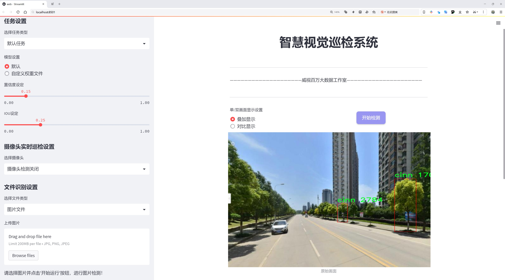
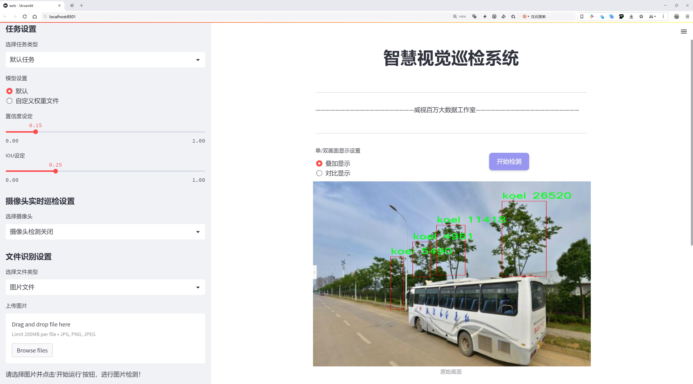
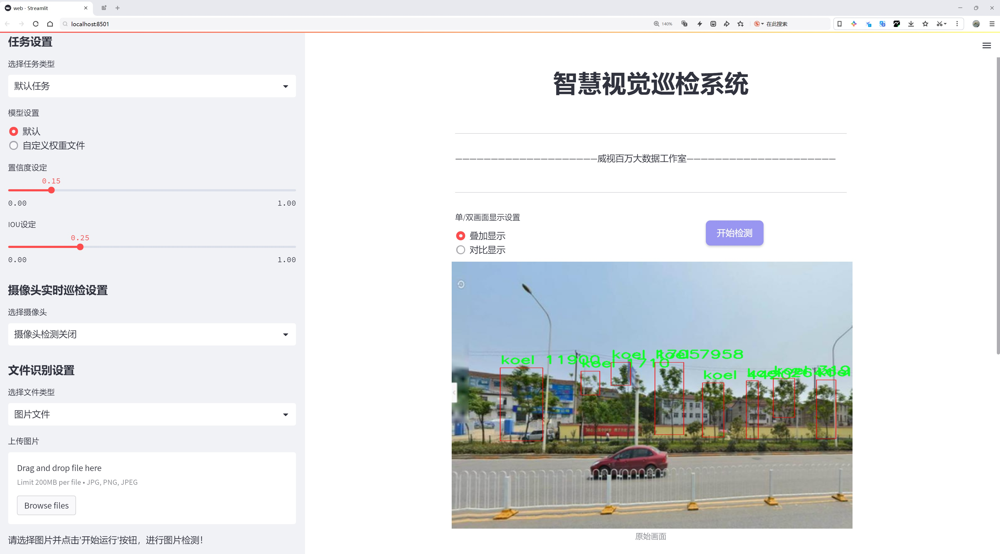
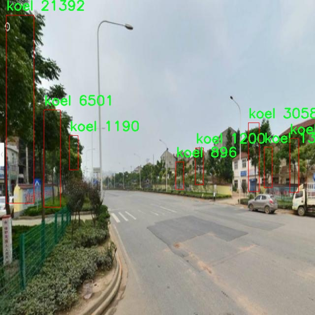
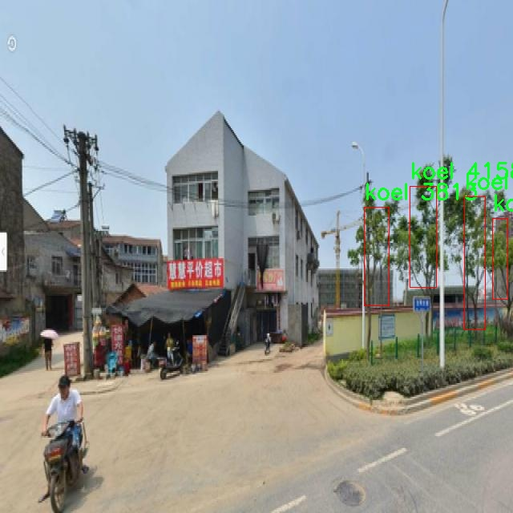
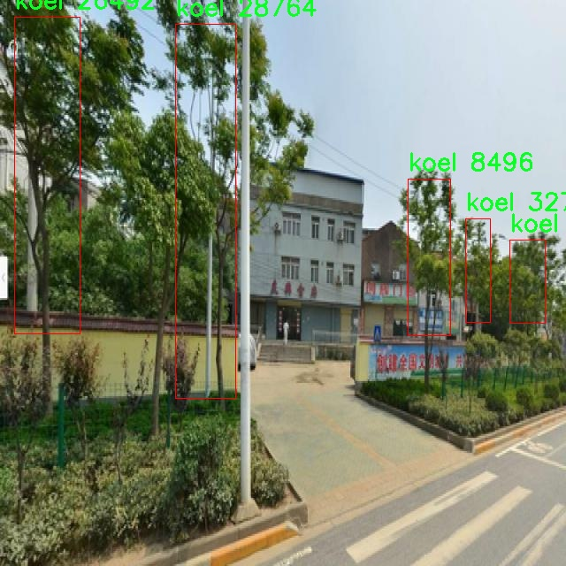
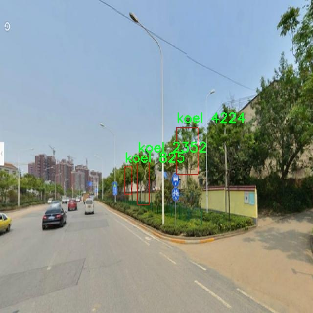
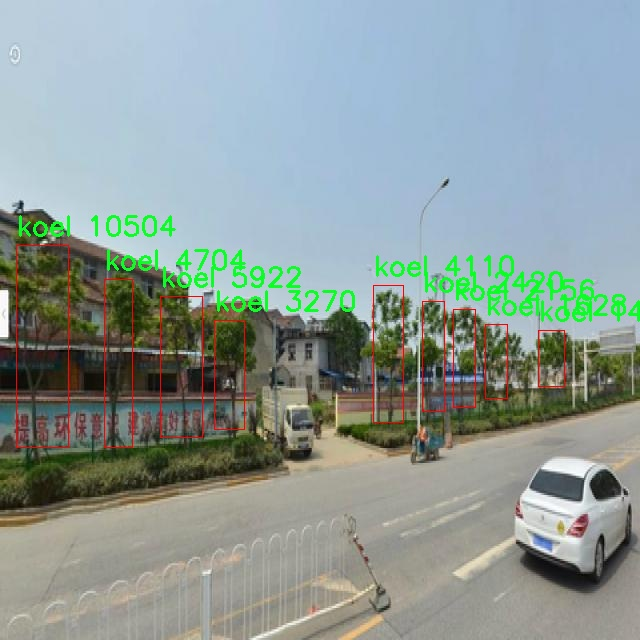

# 路旁树木种类巡检检测系统源码分享
 # [一条龙教学YOLOV8标注好的数据集一键训练_70+全套改进创新点发刊_Web前端展示]

### 1.研究背景与意义

项目参考[AAAI Association for the Advancement of Artificial Intelligence](https://gitee.com/qunmasj/projects)

研究背景与意义

随着城市化进程的加快，城市绿化的重要性日益凸显，树木作为城市生态系统的重要组成部分，承担着改善空气质量、调节气候、提供栖息地等多重功能。然而，城市树木的种类多样性和生长状况直接影响到城市生态环境的健康与可持续发展。因此，建立一个高效、准确的树木种类巡检系统，对于城市绿化管理、生态保护及生物多样性维护具有重要的现实意义。

近年来，计算机视觉和深度学习技术的迅猛发展为植物种类识别提供了新的思路。YOLO（You Only Look Once）系列模型以其高效的实时目标检测能力，逐渐成为植物识别领域的研究热点。YOLOv8作为该系列的最新版本，具有更高的检测精度和更快的处理速度，能够满足城市树木种类巡检的需求。然而，针对特定环境下的树木种类识别，YOLOv8的性能仍有提升空间，尤其是在复杂背景和光照变化的情况下。因此，基于改进YOLOv8的树木种类巡检系统的研究具有重要的学术价值和应用前景。

本研究所使用的数据集“WuHanTrees_Without_Sapi”包含3145张图像，涵盖9个树木种类，包括白杨（albi）、雪松（cedr）、肉桂（cinn）、银杏（gink）、楠木（koel）、木槿（magn）、红枫（meta）、白榆（plat）和柳树（sali）。这些树种在武汉地区具有代表性，反映了当地的生态特征和植物多样性。通过对该数据集的深入分析与处理，可以为树木种类的自动识别提供丰富的样本基础。

改进YOLOv8模型的研究，旨在通过优化网络结构、增强数据预处理和后处理技术，提高模型在树木种类识别中的准确性和鲁棒性。具体而言，研究将探索不同的特征提取方法，利用迁移学习技术对预训练模型进行微调，以适应特定的树木种类识别任务。此外，结合图像增强技术和多尺度检测策略，进一步提升模型在复杂环境下的表现。

本研究的意义不仅在于推动树木种类识别技术的发展，更在于为城市绿化管理提供科学依据。通过建立高效的巡检系统，能够实时监测城市树木的生长状况，及时发现病虫害和环境变化，进而采取相应的管理措施。这将有助于提高城市绿化的科学管理水平，促进生态环境的可持续发展。

综上所述，基于改进YOLOv8的路旁树木种类巡检系统的研究，不仅具有重要的理论价值，也将为实际应用提供切实可行的解决方案。通过这一研究，期望能够为城市生态管理提供新的技术手段，推动生态文明建设的进程。

### 2.图片演示







##### 注意：由于此博客编辑较早，上面“2.图片演示”和“3.视频演示”展示的系统图片或者视频可能为老版本，新版本在老版本的基础上升级如下：（实际效果以升级的新版本为准）

  （1）适配了YOLOV8的“目标检测”模型和“实例分割”模型，通过加载相应的权重（.pt）文件即可自适应加载模型。

  （2）支持“图片识别”、“视频识别”、“摄像头实时识别”三种识别模式。

  （3）支持“图片识别”、“视频识别”、“摄像头实时识别”三种识别结果保存导出，解决手动导出（容易卡顿出现爆内存）存在的问题，识别完自动保存结果并导出到。

  （4）支持Web前端系统中的标题、背景图等自定义修改，后面提供修改教程。

  另外本项目提供训练的数据集和训练教程,暂不提供权重文件（best.pt）,需要您按照教程进行训练后实现图片演示和Web前端界面演示的效果。

### 3.视频演示

[3.1 视频演示](https://www.bilibili.com/video/BV13HsHevEjt/?vd_source=ff015de2d29cbe2a9cdbfa7064407a08)

### 4.数据集信息展示

数据集信息展示

在进行路旁树木种类巡检系统的研究与开发过程中，数据集的选择与构建至关重要。本项目所采用的数据集名为“WuHanTrees_Without_Sapi”，其主要目标是为改进YOLOv8模型提供高质量的训练数据，以实现对路旁树木种类的精准识别与分类。该数据集包含了3145张图像，涵盖了9个不同的树木种类，具有丰富的多样性和代表性，能够有效支持模型的训练与评估。

在这3145张图像中，数据集精心标注了9个类别，分别为：albi（白杨）、cedr（雪松）、cinn（肉桂）、gink（银杏）、koel（青桐）、magn（木兰）、meta（香樟）、plat（白桦）和sali（柳树）。这些树种在城市绿化和生态环境中具有重要的地位，因而在巡检系统中，准确识别这些树种将有助于城市管理者更好地进行绿化维护和生态保护。

数据集的构建过程遵循了严格的标准，确保了图像的质量和标注的准确性。每一张图像都经过专业人员的审核与标注，确保其在不同光照、角度和背景下的表现均能真实反映树木的特征。这种高质量的标注不仅提升了模型的训练效果，也为后续的应用提供了可靠的数据基础。

此外，数据集的多样性体现在不同的生长环境和季节变化上，这对于模型的泛化能力至关重要。通过在不同的场景中进行训练，YOLOv8模型能够更好地适应实际应用中的各种复杂情况，从而提高树木种类识别的准确性和鲁棒性。这一数据集的设计理念，旨在通过多样化的样本，帮助模型学习到更全面的特征，从而在实际应用中实现更高的识别率。

值得一提的是，该数据集遵循CC BY 4.0许可证，允许用户在遵循相关规定的前提下自由使用和分享。这种开放性不仅促进了学术界和工业界的合作，也为更多的研究者提供了宝贵的资源，推动了相关领域的研究进展。

综上所述，“WuHanTrees_Without_Sapi”数据集为改进YOLOv8的路旁树木种类巡检系统提供了坚实的基础。通过丰富的图像数据和准确的标注，该数据集不仅能够提升模型的训练效果，还能为后续的实际应用提供可靠的支持。随着城市绿化管理需求的不断增加，基于这一数据集开发的巡检系统将为城市生态环境的保护与管理提供重要的技术支持，助力实现可持续发展的目标。











### 5.全套项目环境部署视频教程（零基础手把手教学）

[5.1 环境部署教程链接（零基础手把手教学）](https://www.ixigua.com/7404473917358506534?logTag=c807d0cbc21c0ef59de5)


[5.2 安装Python虚拟环境创建和依赖库安装视频教程链接（零基础手把手教学）](https://www.ixigua.com/7404474678003106304?logTag=1f1041108cd1f708b01a)

### 6.手把手YOLOV8训练视频教程（零基础小白有手就能学会）

[6.1 环境部署教程链接（零基础手把手教学）](https://www.ixigua.com/7404477157818401292?logTag=d31a2dfd1983c9668658)

### 7.70+种全套YOLOV8创新点代码加载调参视频教程（一键加载写好的改进模型的配置文件）

[7.1 环境部署教程链接（零基础手把手教学）](https://www.ixigua.com/7404478314661806627?logTag=29066f8288e3f4eea3a4)

### 8.70+种全套YOLOV8创新点原理讲解（非科班也可以轻松写刊发刊，V10版本正在科研待更新）

由于篇幅限制，每个创新点的具体原理讲解就不一一展开，具体见下列网址中的创新点对应子项目的技术原理博客网址【Blog】：


[8.1 70+种全套YOLOV8创新点原理讲解链接](https://gitee.com/qunmasj/good)

### 9.系统功能展示（检测对象为举例，实际内容以本项目数据集为准）

图1.系统支持检测结果表格显示

  图2.系统支持置信度和IOU阈值手动调节

  图3.系统支持自定义加载权重文件best.pt(需要你通过步骤5中训练获得)

  图4.系统支持摄像头实时识别

  图5.系统支持图片识别

  图6.系统支持视频识别

  图7.系统支持识别结果文件自动保存

  图8.系统支持Excel导出检测结果数据


### 10.原始YOLOV8算法原理

原始YOLOv8算法原理

YOLOv8算法是由Glenn-Jocher提出的最新一代YOLO系列目标检测算法，继承了YOLOv3和YOLOv5的设计理念，同时在多个方面进行了创新和改进。YOLOv8的核心目标是提高目标检测的精度和速度，使其在实际应用中更具实用性和灵活性。为了实现这一目标，YOLOv8在数据预处理、骨干网络结构、特征融合、检测头设计以及标签分配策略等多个方面进行了优化。

首先，在数据预处理方面，YOLOv8延续了YOLOv5的策略，采用了多种数据增强技术，以提高模型的泛化能力。具体而言，YOLOv8使用了马赛克增强（Mosaic）、混合增强（Mixup）、空间扰动（Random Perspective）和颜色扰动（HSV Augment）等四种增强手段。这些技术的结合不仅丰富了训练数据的多样性，还有效提升了模型对不同场景和光照条件的适应能力，从而在目标检测任务中表现出更高的鲁棒性。

在骨干网络结构方面，YOLOv8对YOLOv5的设计进行了继承和改进。YOLOv5的主干网络通过一系列步长为2的3×3卷积层进行特征图的降采样，并结合C3模块来强化特征提取。YOLOv8则将C3模块替换为新的C2f模块，C2f模块通过引入更多的分支来丰富梯度回传时的支流，增强了特征提取的能力。这种设计使得网络在提取特征时能够更有效地捕捉到多层次的信息，从而提升了模型的整体性能。

YOLOv8还采用了FPN（特征金字塔网络）和PAN（路径聚合网络）相结合的结构，以构建特征金字塔。这一结构的设计使得多尺度信息能够得到充分融合，从而增强了模型对不同尺寸目标的检测能力。尽管YOLOv8在FPN-PAN结构中将C3模块替换为C2f模块，但其余部分与YOLOv5的设计基本保持一致，确保了特征融合的高效性和准确性。

在检测头的设计上，YOLOv8引入了解耦头（Decoupled Head）结构，这一结构的创新在于将分类和定位任务分开处理。通过设置两条并行的分支，分别提取类别特征和位置特征，YOLOv8能够更高效地完成目标检测任务。这种解耦设计不仅加速了模型的收敛速度，还提高了检测的精度，使得YOLOv8在复杂场景下的表现更加出色。

标签分配策略是YOLOv8的一大亮点。与YOLOv5依赖于候选框聚类的方式不同，YOLOv8采用了动态标签分配策略，称为TOOD（Task-Oriented Object Detection）。这一策略通过只使用目标边界框和目标分数，简化了标签分配的过程。YOLOv8的损失函数主要由类别损失和位置损失两部分组成，其中类别损失采用了变焦损失（Varifocal Loss），而位置损失则结合了CIoU Loss和DFL Loss。变焦损失通过不对称参数对正负样本进行加权，强调了高质量正样本对模型训练的重要性，同时降低了负样本对损失的影响。这种处理方式使得YOLOv8在训练过程中能够更有效地聚焦于高质量样本，从而提升了模型的检测精度。

总的来说，YOLOv8算法在多个方面的改进使其在目标检测领域中展现出了优越的性能。通过优化数据预处理、骨干网络结构、特征融合方式、检测头设计以及标签分配策略，YOLOv8不仅提高了检测精度，还加快了模型的推理速度。这些创新使得YOLOv8在实际应用中更具竞争力，能够满足日益增长的目标检测需求，尤其是在实时性和准确性要求较高的场景中，YOLOv8无疑是一个值得关注的选择。


### 11.项目核心源码讲解（再也不用担心看不懂代码逻辑）

#### 11.1 ultralytics\nn\autobackend.py

以下是经过精简和注释的核心代码，主要集中在模型的加载和推理部分。注释详细解释了每个部分的功能和目的。

```python
import torch
import torch.nn as nn
from ultralytics.utils import LOGGER, yaml_load
from ultralytics.utils.downloads import attempt_download_asset

class AutoBackend(nn.Module):
    """
    处理Ultralytics YOLO模型的动态后端选择，用于推理。
    """

    @torch.no_grad()
    def __init__(self, weights="yolov8n.pt", device=torch.device("cpu"), fp16=False, fuse=True, data=None):
        """
        初始化AutoBackend以进行推理。

        参数:
            weights (str): 模型权重文件的路径，默认为'yolov8n.pt'。
            device (torch.device): 运行模型的设备，默认为CPU。
            fp16 (bool): 启用半精度推理，仅在特定后端支持，默认为False。
            fuse (bool): 合并Conv2D + BatchNorm层以优化，默认为True。
            data (str | Path | optional): 包含类名的额外data.yaml文件的路径，默认为None。
        """
        super().__init__()
        w = str(weights)
        model_type = self._model_type(w)  # 获取模型类型
        self.device = device
        self.fp16 = fp16

        # 下载模型（如果不是本地文件）
        if not model_type[0]:  # 如果不是PyTorch模型
            w = attempt_download_asset(w)

        # 加载模型
        if model_type[0]:  # PyTorch模型
            self.model = torch.load(w, map_location=device)  # 加载PyTorch模型
        else:
            raise TypeError(f"模型格式不支持: {w}")

        # 设置模型为评估模式
        self.model.eval()

        # 如果启用半精度
        if self.fp16:
            self.model.half()

        # 加载类名
        self.names = self._load_class_names(data)

    def forward(self, im):
        """
        对输入图像进行推理。

        参数:
            im (torch.Tensor): 进行推理的图像张量。

        返回:
            (torch.Tensor): 推理结果。
        """
        if self.fp16 and im.dtype != torch.float16:
            im = im.half()  # 转换为FP16
        with torch.no_grad():
            return self.model(im)  # 进行推理

    def _load_class_names(self, data):
        """
        加载类名。

        参数:
            data (str | Path | optional): 类名文件的路径。

        返回:
            dict: 类名字典。
        """
        if data:
            return yaml_load(data)["names"]  # 从YAML文件加载类名
        return {i: f"class{i}" for i in range(999)}  # 默认类名

    @staticmethod
    def _model_type(p):
        """
        根据模型文件路径返回模型类型。

        参数:
            p (str): 模型文件路径。

        返回:
            list: 模型类型的布尔值列表。
        """
        suffixes = ['.pt', '.onnx', '.mlmodel']  # 支持的后缀
        return [p.endswith(suffix) for suffix in suffixes]  # 检查后缀
```

### 代码说明：
1. **类 `AutoBackend`**: 该类负责加载不同格式的YOLO模型并执行推理。
2. **`__init__` 方法**: 初始化模型，下载权重文件（如果需要），并加载模型。支持半精度推理。
3. **`forward` 方法**: 接收输入图像并返回推理结果。
4. **`_load_class_names` 方法**: 从指定的YAML文件加载类名，或返回默认类名。
5. **`_model_type` 方法**: 根据模型文件的后缀判断模型类型。

此代码的核心功能是模型的加载和推理，提供了一个灵活的接口来处理不同格式的YOLO模型。

这个文件是Ultralytics YOLO（You Only Look Once）模型的一个核心组件，主要负责动态选择后端以进行推理。文件中包含了多个重要的功能和类，下面将对其进行逐步分析。

首先，文件导入了一些必要的库，包括Python的标准库和一些第三方库，如`torch`、`cv2`、`numpy`等。这些库为模型的加载、处理和推理提供了支持。

接下来，定义了一个名为`check_class_names`的函数，用于检查和处理类别名称。这个函数能够将类别名称从列表转换为字典，并确保类别索引的有效性。如果输入的类别名称不符合要求，函数会抛出一个`KeyError`。

`default_class_names`函数则提供了默认的类别名称，若输入数据有效，则从指定的YAML文件中加载类别名称；如果无效，则返回一个默认的类名字典。

`AutoBackend`类是该文件的核心，负责根据输入模型的格式动态选择推理后端。类的构造函数接受多个参数，包括模型权重路径、设备类型、是否使用DNN模块、数据文件路径等。构造函数内部首先判断模型的类型，并根据不同的模型格式进行相应的加载和初始化。

在模型加载过程中，`AutoBackend`类支持多种格式，如PyTorch、TorchScript、ONNX、TensorRT等。每种格式都有其特定的加载方式和处理逻辑。例如，对于PyTorch模型，使用`attempt_load_weights`函数加载权重；对于ONNX模型，使用`cv2.dnn.readNetFromONNX`函数读取模型。

此外，类中还包含了一个`forward`方法，该方法实现了模型的推理逻辑。它接受一个图像张量，并根据不同的后端执行推理，最终返回推理结果。该方法支持数据增强和可视化输出。

`from_numpy`方法用于将NumPy数组转换为PyTorch张量，`warmup`方法则用于通过运行一次前向传播来预热模型，以提高后续推理的速度。

最后，`_model_type`静态方法用于根据模型文件的路径判断模型的类型，返回一个布尔值列表，指示支持的模型格式。

总体而言，这个文件为YOLO模型提供了灵活的后端支持，使得用户可以方便地在不同的推理引擎上运行模型，同时也提供了必要的错误检查和类别名称处理功能。

#### 11.2 ui.py

以下是经过简化和详细注释的核心代码部分：

```python
import sys
import subprocess

def run_script(script_path):
    """
    使用当前 Python 环境运行指定的脚本。

    Args:
        script_path (str): 要运行的脚本路径

    Returns:
        None
    """
    # 获取当前 Python 解释器的路径
    python_path = sys.executable

    # 构建运行命令，使用 streamlit 运行指定的脚本
    command = f'"{python_path}" -m streamlit run "{script_path}"'

    # 执行命令，并等待其完成
    result = subprocess.run(command, shell=True)
    
    # 检查命令执行结果，如果返回码不为0，则表示出错
    if result.returncode != 0:
        print("脚本运行出错。")

# 主程序入口
if __name__ == "__main__":
    # 指定要运行的脚本路径
    script_path = "web.py"  # 假设脚本在当前目录下

    # 调用函数运行脚本
    run_script(script_path)
```

### 代码注释说明：

1. **导入模块**：
   - `sys`：用于获取当前 Python 解释器的路径。
   - `subprocess`：用于执行外部命令。

2. **定义 `run_script` 函数**：
   - 该函数接受一个参数 `script_path`，表示要运行的 Python 脚本的路径。
   - 函数内部首先获取当前 Python 解释器的路径，然后构建一个命令字符串，用于运行 `streamlit`。

3. **执行命令**：
   - 使用 `subprocess.run` 执行构建的命令，并等待其完成。
   - 检查命令的返回码，如果返回码不为0，表示脚本运行出错，打印相应的错误信息。

4. **主程序入口**：
   - 在 `if __name__ == "__main__":` 语句块中，指定要运行的脚本路径，并调用 `run_script` 函数来执行该脚本。

这个程序文件名为 `ui.py`，其主要功能是通过当前的 Python 环境来运行一个指定的脚本，具体是使用 Streamlit 框架来启动一个 Web 应用。

程序首先导入了必要的模块，包括 `sys`、`os` 和 `subprocess`，其中 `sys` 用于访问与 Python 解释器相关的变量和函数，`os` 提供了与操作系统交互的功能，而 `subprocess` 则用于执行外部命令。

接着，程序从 `QtFusion.path` 模块中导入了 `abs_path` 函数，这个函数的作用是获取给定路径的绝对路径。

在 `run_script` 函数中，程序接受一个参数 `script_path`，该参数是要运行的脚本的路径。函数首先获取当前 Python 解释器的路径，并将其存储在 `python_path` 变量中。然后，构建一个命令字符串，该命令使用当前的 Python 解释器和 Streamlit 模块来运行指定的脚本。接下来，使用 `subprocess.run` 方法执行这个命令，并通过 `shell=True` 参数允许在 shell 中执行命令。

如果命令执行后返回的状态码不为零，说明脚本运行出错，程序会打印出相应的错误信息。

在文件的最后部分，程序通过 `if __name__ == "__main__":` 判断是否是直接运行该脚本。如果是，程序会调用 `abs_path` 函数获取 `web.py` 脚本的绝对路径，并将其传递给 `run_script` 函数以启动该脚本。

总体来说，这个程序的核心功能是通过命令行启动一个 Streamlit Web 应用，且能够处理脚本运行中的错误。

#### 11.3 ultralytics\engine\validator.py

以下是经过简化并注释的核心代码部分，主要集中在 `BaseValidator` 类的关键功能上：

```python
import json
import time
from pathlib import Path
import torch
from ultralytics.utils import LOGGER, TQDM, callbacks
from ultralytics.utils.torch_utils import select_device, smart_inference_mode

class BaseValidator:
    """
    BaseValidator类用于创建模型验证器，负责模型在验证集上的评估。
    """

    def __init__(self, dataloader=None, save_dir=None, args=None, _callbacks=None):
        """
        初始化BaseValidator实例。

        Args:
            dataloader (torch.utils.data.DataLoader): 用于验证的数据加载器。
            save_dir (Path, optional): 结果保存目录。
            args (SimpleNamespace): 验证器的配置参数。
            _callbacks (dict): 存储各种回调函数的字典。
        """
        self.args = args  # 配置参数
        self.dataloader = dataloader  # 数据加载器
        self.save_dir = save_dir or Path("results")  # 结果保存目录
        self.callbacks = _callbacks or callbacks.get_default_callbacks()  # 默认回调函数

    @smart_inference_mode()
    def __call__(self, model=None):
        """
        执行验证过程。
        """
        self.device = select_device(self.args.device)  # 选择设备
        model.eval()  # 设置模型为评估模式

        # 初始化进度条
        bar = TQDM(self.dataloader, desc="Validating", total=len(self.dataloader))
        for batch_i, batch in enumerate(bar):
            # 预处理输入数据
            batch = self.preprocess(batch)

            # 模型推理
            preds = model(batch["img"])

            # 更新指标
            self.update_metrics(preds, batch)

            # 在每个批次结束时运行回调
            self.run_callbacks("on_val_batch_end")

        # 打印结果
        self.print_results()

    def preprocess(self, batch):
        """对输入批次进行预处理。"""
        return batch  # 此处可以添加实际的预处理逻辑

    def update_metrics(self, preds, batch):
        """根据预测结果和批次更新指标。"""
        pass  # 此处可以添加实际的指标更新逻辑

    def run_callbacks(self, event: str):
        """运行与指定事件相关的所有回调函数。"""
        for callback in self.callbacks.get(event, []):
            callback(self)

    def print_results(self):
        """打印模型预测的结果。"""
        LOGGER.info("Validation complete.")  # 打印验证完成信息
```

### 代码注释说明：

1. **类定义**：`BaseValidator` 类是一个基类，用于创建模型验证器，主要负责模型在验证集上的评估。

2. **初始化方法**：`__init__` 方法用于初始化验证器的基本属性，包括数据加载器、保存目录和回调函数。

3. **调用方法**：`__call__` 方法是验证的主要入口，负责执行验证过程，包括选择设备、设置模型为评估模式、遍历数据加载器、进行推理和更新指标。

4. **预处理方法**：`preprocess` 方法用于对输入批次进行预处理，可以根据需要添加具体的预处理逻辑。

5. **更新指标方法**：`update_metrics` 方法用于根据模型的预测结果和输入批次更新验证指标。

6. **回调方法**：`run_callbacks` 方法用于执行与特定事件相关的回调函数，便于在验证过程中添加自定义行为。

7. **结果打印方法**：`print_results` 方法用于打印验证完成的信息，实际应用中可以扩展为打印更详细的结果。 

通过这些注释，可以更清晰地理解代码的结构和功能。

这个程序文件 `ultralytics/engine/validator.py` 是一个用于验证模型准确性的类定义，主要针对 YOLO（You Only Look Once）系列的目标检测模型。文件中包含了一个名为 `BaseValidator` 的类，它为模型验证提供了基础框架和方法。

首先，文件开头提供了关于如何使用这个验证器的说明，包括命令行用法和支持的模型格式。这些格式包括 PyTorch、TorchScript、ONNX、OpenVINO、TensorRT 等，用户可以根据需要选择合适的模型格式进行验证。

`BaseValidator` 类的构造函数 `__init__` 初始化了一些重要的属性，包括数据加载器、保存结果的目录、进度条、模型参数等。它还会根据传入的参数配置进行相应的设置，例如默认的置信度阈值和图像尺寸检查。

`__call__` 方法是这个类的核心，支持对预训练模型或正在训练的模型进行验证。根据是否传入训练器对象，方法会决定如何处理模型和数据。在训练模式下，它会使用训练器的设备和数据，并将模型设置为评估模式。在非训练模式下，它会通过 `AutoBackend` 类加载模型，并进行必要的预处理和准备工作。

在验证过程中，`BaseValidator` 会使用进度条显示验证进度，并通过调用一系列方法来处理每个批次的数据，包括预处理、推理、损失计算和后处理。它还会更新性能指标，并在每个批次结束时运行相应的回调函数。

`match_predictions` 方法用于将模型的预测结果与真实标签进行匹配，基于 IoU（Intersection over Union）计算正确的预测。该方法支持使用 SciPy 库进行更精确的匹配。

类中还定义了一些用于回调的管理方法，例如 `add_callback` 和 `run_callbacks`，这些方法允许用户在特定事件发生时执行自定义操作。

此外，`BaseValidator` 还定义了一些抽象方法（如 `get_dataloader` 和 `build_dataset`），这些方法需要在子类中实现，以便根据具体的数据集类型进行数据加载和构建。

最后，类中还包含了一些用于性能指标初始化、更新、最终化和打印结果的方法，这些方法为用户提供了对模型验证结果的全面了解。

总体而言，这个文件为 YOLO 模型的验证提供了一个结构化的框架，允许用户灵活地进行模型评估和性能分析。

#### 11.4 train.py

以下是经过简化和注释的核心代码部分：

```python
import os
import torch
import yaml
from ultralytics import YOLO  # 导入YOLO模型库
from QtFusion.path import abs_path  # 导入路径处理工具

# 确定使用的设备，如果有可用的GPU则使用GPU，否则使用CPU
device = "0" if torch.cuda.is_available() else "cpu"

if __name__ == '__main__':  # 确保该模块被直接运行时才执行以下代码
    # 设置训练参数
    workers = 1  # 数据加载的工作进程数
    batch = 2    # 每个批次的样本数量

    # 指定数据集名称
    data_name = "data"
    # 获取数据集yaml文件的绝对路径
    data_path = abs_path(f'datasets/{data_name}/{data_name}.yaml', path_type='current')
    
    # 获取数据集目录路径
    directory_path = os.path.dirname(data_path)
    
    # 读取YAML文件，保持原有顺序
    with open(data_path, 'r') as file:
        data = yaml.load(file, Loader=yaml.FullLoader)
    
    # 如果YAML文件中包含'path'项，则修改为当前目录路径
    if 'path' in data:
        data['path'] = directory_path
        # 将修改后的数据写回YAML文件
        with open(data_path, 'w') as file:
            yaml.safe_dump(data, file, sort_keys=False)

    # 加载YOLOv8模型，指定配置文件和任务类型
    model = YOLO(model='./ultralytics/cfg/models/v8/yolov8s.yaml', task='detect')
    
    # 开始训练模型
    results2 = model.train(
        data=data_path,  # 指定训练数据的配置文件路径
        device=device,    # 使用指定的设备进行训练
        workers=workers,  # 指定工作进程数
        imgsz=640,        # 输入图像的大小为640x640
        epochs=100,      # 训练100个epoch
        batch=batch,      # 每个批次的大小
        name='train_v8_' + data_name  # 指定训练任务的名称
    )
```

### 代码说明：
1. **导入必要的库**：导入了处理文件路径、模型训练和YAML文件的库。
2. **设备选择**：根据是否有可用的GPU选择训练设备。
3. **主程序入口**：使用`if __name__ == '__main__':`确保只有直接运行该脚本时才执行后续代码。
4. **设置训练参数**：定义数据加载的工作进程数和每个批次的样本数量。
5. **数据集路径处理**：获取数据集的绝对路径，并读取YAML配置文件。
6. **修改YAML文件**：如果YAML文件中有`path`项，则更新为当前目录路径，并将修改后的内容写回文件。
7. **模型加载**：加载YOLOv8模型的配置文件。
8. **模型训练**：调用模型的训练方法，传入必要的参数进行训练。

这个程序文件 `train.py` 的主要功能是使用 YOLOv8 模型进行目标检测的训练。首先，程序导入了必要的库，包括 `os`、`torch`、`yaml` 和 `ultralytics` 中的 YOLO 模型。接着，程序会根据是否有可用的 GPU 来选择计算设备，如果有可用的 GPU，则使用 GPU，否则使用 CPU。

在 `__main__` 代码块中，程序设置了一些训练参数，包括工作进程数量和批次大小。接下来，程序定义了数据集的名称，并构建了数据集 YAML 文件的绝对路径。通过 `abs_path` 函数，程序能够获取到当前工作目录下的相应路径。

程序读取指定路径下的 YAML 文件，并将其内容加载到 `data` 变量中。为了确保数据集路径的正确性，程序检查 YAML 文件中是否包含 `path` 项，如果有，则将其修改为数据集所在目录的路径，并将修改后的内容写回到 YAML 文件中。

随后，程序加载了预训练的 YOLOv8 模型，指定了模型的配置文件。接下来，调用 `model.train` 方法开始训练模型。在训练过程中，程序指定了多个参数，包括训练数据的配置文件路径、计算设备、工作进程数量、输入图像的大小（640x640）、训练的轮数（100 个 epoch）以及训练任务的名称。

总体而言，这段代码实现了目标检测模型的训练过程，包括数据集的准备、模型的加载和训练参数的设置。

#### 11.5 ultralytics\data\converter.py

以下是代码中最核心的部分，并附上详细的中文注释：

```python
def coco91_to_coco80_class():
    """
    将91个COCO类ID转换为80个COCO类ID。

    返回:
        (list): 一个包含91个类ID的列表，其中索引表示80个类ID，值为对应的91个类ID。
    """
    return [
        0, 1, 2, 3, 4, 5, 6, 7, 8, 9, 10, None, 11, 12, 13, 14, 15, 16, 17, 18, 19, 20,
        21, 22, 23, None, 24, 25, None, None, 26, 27, 28, 29, 30, 31, 32, 33, 34, 35,
        36, 37, 38, 39, None, 40, 41, 42, 43, 44, 45, 46, 47, 48, 49, 50, 51, 52, 53,
        54, 55, 56, 57, 58, 59, None, 60, None, None, 61, None, 62, 63, 64, 65, 66, 67,
        68, 69, 70, 71, 72, None, 73, 74, 75, 76, 77, 78, 79, None,
    ]


def convert_coco(
    labels_dir="../coco/annotations/",
    save_dir="coco_converted/",
    use_segments=False,
    use_keypoints=False,
    cls91to80=True,
):
    """
    将COCO数据集的注释转换为适合训练YOLO模型的YOLO注释格式。

    参数:
        labels_dir (str, optional): 包含COCO数据集注释文件的目录路径。
        save_dir (str, optional): 保存结果的目录路径。
        use_segments (bool, optional): 是否在输出中包含分割掩码。
        use_keypoints (bool, optional): 是否在输出中包含关键点注释。
        cls91to80 (bool, optional): 是否将91个COCO类ID映射到对应的80个COCO类ID。

    输出:
        在指定的输出目录中生成输出文件。
    """

    # 创建数据集目录
    save_dir = increment_path(save_dir)  # 如果保存目录已存在，则递增
    for p in save_dir / "labels", save_dir / "images":
        p.mkdir(parents=True, exist_ok=True)  # 创建目录

    # 转换类
    coco80 = coco91_to_coco80_class()

    # 导入json
    for json_file in sorted(Path(labels_dir).resolve().glob("*.json")):
        fn = Path(save_dir) / "labels" / json_file.stem.replace("instances_", "")  # 文件夹名称
        fn.mkdir(parents=True, exist_ok=True)
        with open(json_file) as f:
            data = json.load(f)

        # 创建图像字典
        images = {f'{x["id"]:d}': x for x in data["images"]}
        # 创建图像-注释字典
        imgToAnns = defaultdict(list)
        for ann in data["annotations"]:
            imgToAnns[ann["image_id"]].append(ann)

        # 写入标签文件
        for img_id, anns in TQDM(imgToAnns.items(), desc=f"Annotations {json_file}"):
            img = images[f"{img_id:d}"]
            h, w, f = img["height"], img["width"], img["file_name"]

            bboxes = []  # 存储边界框
            segments = []  # 存储分割
            keypoints = []  # 存储关键点
            for ann in anns:
                if ann["iscrowd"]:
                    continue  # 跳过人群注释
                # COCO框格式为[左上角x, 左上角y, 宽度, 高度]
                box = np.array(ann["bbox"], dtype=np.float64)
                box[:2] += box[2:] / 2  # 将左上角坐标转换为中心坐标
                box[[0, 2]] /= w  # 归一化x坐标
                box[[1, 3]] /= h  # 归一化y坐标
                if box[2] <= 0 or box[3] <= 0:  # 如果宽度或高度小于等于0
                    continue

                cls = coco80[ann["category_id"] - 1] if cls91to80 else ann["category_id"] - 1  # 类别
                box = [cls] + box.tolist()  # 将类别和边界框合并
                if box not in bboxes:
                    bboxes.append(box)  # 添加边界框
                    if use_segments and ann.get("segmentation") is not None:
                        # 处理分割信息
                        if len(ann["segmentation"]) == 0:
                            segments.append([])
                            continue
                        elif len(ann["segmentation"]) > 1:
                            s = merge_multi_segment(ann["segmentation"])  # 合并多个分割
                            s = (np.concatenate(s, axis=0) / np.array([w, h])).reshape(-1).tolist()
                        else:
                            s = [j for i in ann["segmentation"] for j in i]  # 所有分割连接
                            s = (np.array(s).reshape(-1, 2) / np.array([w, h])).reshape(-1).tolist()
                        s = [cls] + s
                        segments.append(s)  # 添加分割信息
                    if use_keypoints and ann.get("keypoints") is not None:
                        keypoints.append(
                            box + (np.array(ann["keypoints"]).reshape(-1, 3) / np.array([w, h, 1])).reshape(-1).tolist()
                        )  # 添加关键点信息

            # 写入文件
            with open((fn / f).with_suffix(".txt"), "a") as file:
                for i in range(len(bboxes)):
                    if use_keypoints:
                        line = (*(keypoints[i]),)  # 类别、边界框、关键点
                    else:
                        line = (
                            *(segments[i] if use_segments and len(segments[i]) > 0 else bboxes[i]),
                        )  # 类别、边界框或分割
                    file.write(("%g " * len(line)).rstrip() % line + "\n")  # 写入行

    LOGGER.info(f"COCO数据成功转换。\n结果保存到 {save_dir.resolve()}")
```

### 代码说明：
1. **coco91_to_coco80_class**: 该函数用于将91个COCO类ID转换为80个COCO类ID，返回一个列表，其中索引对应80个类ID，值为对应的91个类ID。

2. **convert_coco**: 该函数用于将COCO数据集的注释转换为YOLO格式。它接收多个参数以指定输入和输出路径、是否使用分割和关键点等选项。函数的主要流程包括创建输出目录、读取JSON文件、处理图像和注释，并将结果写入YOLO格式的文本文件中。

3. **注释部分**: 在处理每个注释时，函数会将边界框的坐标转换为YOLO格式，归一化到[0, 1]范围内，并根据需要处理分割和关键点信息。最终，所有信息都会写入到指定的文本文件中。

这个程序文件 `ultralytics\data\converter.py` 主要用于将 COCO 数据集的标注格式转换为 YOLO 模型所需的格式。文件中包含了多个函数，每个函数负责不同的转换任务。

首先，文件定义了两个函数 `coco91_to_coco80_class` 和 `coco80_to_coco91_class`，这两个函数用于在 COCO 数据集中将 91 个类别的 ID 转换为 80 个类别的 ID，反之亦然。这是因为在 COCO 数据集中，某些类别被合并或忽略，因此需要进行 ID 的映射。

接下来，`convert_coco` 函数是主要的转换函数。它接受多个参数，包括标注文件的目录、保存结果的目录、是否使用分割掩码和关键点等。该函数首先创建保存结果的目录，并确保其结构符合 YOLO 格式。然后，它读取 COCO 数据集的 JSON 文件，提取图像和标注信息，并将其转换为 YOLO 所需的格式。具体来说，它将 COCO 的边界框格式转换为 YOLO 的格式，归一化坐标，并根据需要处理分割和关键点信息。最后，生成的标注文件将被保存到指定的目录中。

此外，文件中还定义了 `convert_dota_to_yolo_obb` 函数，用于将 DOTA 数据集的标注转换为 YOLO 的有向边界框格式。该函数处理 DOTA 数据集中的训练和验证图像，读取原始标签并将其转换为 YOLO 格式，最后保存到新的目录中。

文件中还包含了一些辅助函数，例如 `min_index` 用于找到两个数组中最近点的索引，`merge_multi_segment` 用于合并多个分割段，以便将它们连接成一个完整的分割。

总的来说，这个程序文件的核心功能是实现不同数据集标注格式之间的转换，以便于在 YOLO 模型中使用。通过这些转换，用户可以更方便地利用不同数据集进行模型训练和评估。

#### 11.6 ultralytics\models\yolo\classify\train.py

以下是代码中最核心的部分，并附上详细的中文注释：

```python
import torch
from ultralytics.data import ClassificationDataset, build_dataloader
from ultralytics.engine.trainer import BaseTrainer
from ultralytics.models import yolo
from ultralytics.nn.tasks import ClassificationModel, attempt_load_one_weight
from ultralytics.utils import DEFAULT_CFG, LOGGER, RANK
from ultralytics.utils.torch_utils import is_parallel, strip_optimizer, torch_distributed_zero_first

class ClassificationTrainer(BaseTrainer):
    """
    扩展自 BaseTrainer 类的分类模型训练类。
    """

    def __init__(self, cfg=DEFAULT_CFG, overrides=None, _callbacks=None):
        """初始化 ClassificationTrainer 对象，支持配置覆盖和回调函数。"""
        if overrides is None:
            overrides = {}
        overrides["task"] = "classify"  # 设置任务类型为分类
        if overrides.get("imgsz") is None:
            overrides["imgsz"] = 224  # 默认图像大小为224
        super().__init__(cfg, overrides, _callbacks)  # 调用父类构造函数

    def set_model_attributes(self):
        """从加载的数据集中设置 YOLO 模型的类名。"""
        self.model.names = self.data["names"]

    def get_model(self, cfg=None, weights=None, verbose=True):
        """返回配置好的 PyTorch 模型以进行 YOLO 训练。"""
        model = ClassificationModel(cfg, nc=self.data["nc"], verbose=verbose and RANK == -1)  # 创建分类模型
        if weights:
            model.load(weights)  # 加载权重

        for m in model.modules():
            if not self.args.pretrained and hasattr(m, "reset_parameters"):
                m.reset_parameters()  # 重置模型参数
            if isinstance(m, torch.nn.Dropout) and self.args.dropout:
                m.p = self.args.dropout  # 设置 dropout 概率
        for p in model.parameters():
            p.requires_grad = True  # 设置参数可训练
        return model

    def build_dataset(self, img_path, mode="train", batch=None):
        """根据图像路径和模式（训练/测试等）创建 ClassificationDataset 实例。"""
        return ClassificationDataset(root=img_path, args=self.args, augment=mode == "train", prefix=mode)

    def get_dataloader(self, dataset_path, batch_size=16, rank=0, mode="train"):
        """返回用于推理的 PyTorch DataLoader，并对图像进行预处理。"""
        with torch_distributed_zero_first(rank):  # 如果使用分布式数据并行，确保数据集只初始化一次
            dataset = self.build_dataset(dataset_path, mode)  # 构建数据集

        loader = build_dataloader(dataset, batch_size, self.args.workers, rank=rank)  # 创建 DataLoader
        return loader

    def preprocess_batch(self, batch):
        """预处理一批图像和类别。"""
        batch["img"] = batch["img"].to(self.device)  # 将图像移到设备上
        batch["cls"] = batch["cls"].to(self.device)  # 将类别移到设备上
        return batch

    def final_eval(self):
        """评估训练好的模型并保存验证结果。"""
        for f in self.last, self.best:
            if f.exists():
                strip_optimizer(f)  # 去除优化器信息
                if f is self.best:
                    LOGGER.info(f"\nValidating {f}...")  # 日志记录验证信息
                    self.metrics = self.validator(model=f)  # 进行验证
                    self.metrics.pop("fitness", None)  # 移除不需要的指标
        LOGGER.info(f"Results saved to {self.save_dir}")  # 日志记录结果保存路径
```

### 代码核心部分解释：
1. **类的定义**：`ClassificationTrainer` 类继承自 `BaseTrainer`，用于处理分类任务的训练。
2. **初始化方法**：设置任务类型、图像大小等参数，并调用父类的初始化方法。
3. **模型设置**：通过 `set_model_attributes` 和 `get_model` 方法设置模型的类名和加载权重。
4. **数据集和数据加载**：`build_dataset` 和 `get_dataloader` 方法用于创建数据集和数据加载器，支持分布式训练。
5. **预处理**：`preprocess_batch` 方法将图像和类别数据移动到指定设备（如 GPU）。
6. **最终评估**：`final_eval` 方法用于评估训练后的模型并保存结果。

这些核心部分是实现分类训练的基础，涵盖了模型的初始化、数据处理和训练过程中的关键步骤。

这个程序文件是用于训练基于YOLO（You Only Look Once）模型的分类任务的。它继承自`BaseTrainer`类，提供了一系列用于设置和训练分类模型的方法。程序的主要功能包括模型的初始化、数据集的构建、数据加载器的创建、训练过程的管理以及最终的评估和结果可视化。

在初始化方法中，程序接收配置参数和覆盖参数，并设置默认的图像大小为224。`set_model_attributes`方法用于从加载的数据集中设置模型的类别名称。`get_model`方法则返回一个配置好的PyTorch模型，并根据需要加载预训练权重。

`setup_model`方法负责加载模型，可以从本地文件、Torchvision模型或Ultralytics的资源中获取模型。如果模型是以`.pt`结尾的文件，程序会尝试加载该权重；如果是以`.yaml`或`.yml`结尾，则会调用`get_model`方法；如果是Torchvision中的模型名，则直接创建相应的模型实例。

`build_dataset`方法用于创建一个分类数据集实例，`get_dataloader`方法则返回一个PyTorch的数据加载器，用于在训练或测试时对图像进行预处理。`preprocess_batch`方法对图像和类别进行预处理，确保它们在正确的设备上进行训练。

在训练过程中，`progress_string`方法返回一个格式化的字符串，显示训练进度。`get_validator`方法返回一个用于验证的实例，`label_loss_items`方法则生成一个带有标签的损失字典，尽管对于分类任务并不需要。

`plot_metrics`方法用于从CSV文件中绘制训练过程中的指标，`final_eval`方法则对训练好的模型进行评估并保存验证结果。最后，`plot_training_samples`方法用于绘制带有注释的训练样本图像。

总体而言，这个文件提供了一个完整的框架，用于训练YOLO模型进行图像分类任务，涵盖了从模型加载、数据处理到训练和评估的各个方面。

### 12.系统整体结构（节选）

### 整体功能和构架概括

该项目是一个基于YOLO（You Only Look Once）模型的目标检测和分类框架，主要用于训练、验证和推理。项目结构清晰，包含多个模块，每个模块负责特定的功能。整体上，项目可以分为以下几个部分：

1. **模型训练与验证**：包括模型的训练、验证和评估，提供了灵活的接口以支持不同的数据集和模型格式。
2. **数据处理**：负责将不同格式的数据集（如COCO、DOTA等）转换为YOLO所需的格式，并提供数据加载和预处理功能。
3. **模型管理**：支持动态选择和加载不同的模型后端，确保用户可以根据需求灵活使用。
4. **用户界面**：提供了简单的用户界面，以便用户可以通过命令行或Web应用启动训练和验证过程。
5. **工具与实用程序**：包括各种实用工具，如回调函数、损失计算、图像处理等，帮助用户更好地管理训练过程。

### 文件功能整理表

| 文件路径                                          | 功能描述                                                   |
|--------------------------------------------------|----------------------------------------------------------|
| `ultralytics\nn\autobackend.py`                 | 动态选择和加载模型后端，支持多种模型格式的推理。                |
| `ui.py`                                          | 启动Streamlit Web应用，提供用户界面以运行指定的训练脚本。        |
| `ultralytics\engine\validator.py`               | 提供模型验证的框架，支持性能指标计算和结果可视化。               |
| `train.py`                                       | 负责YOLO模型的训练过程，包括数据集准备和模型训练参数设置。       |
| `ultralytics\data\converter.py`                  | 将不同数据集格式（如COCO、DOTA）转换为YOLO所需的标注格式。       |
| `ultralytics\models\yolo\classify\train.py`     | 训练YOLO模型进行图像分类，包含模型初始化和训练过程管理。         |
| `ultralytics\models\yolo\segment\val.py`        | 验证YOLO模型的分割任务，评估模型性能并生成结果。                 |
| `ultralytics\nn\modules\conv.py`                 | 定义卷积层和相关操作，构建YOLO模型的神经网络结构。               |
| `ultralytics\utils\callbacks\dvc.py`            | 提供回调函数功能，支持训练过程中的自定义操作和事件处理。         |
| `ultralytics\trackers\utils\matching.py`        | 实现目标匹配算法，支持目标跟踪和检测结果的匹配。                 |

这个表格总结了项目中各个文件的主要功能，帮助用户快速了解每个模块的作用。

注意：由于此博客编辑较早，上面“11.项目核心源码讲解（再也不用担心看不懂代码逻辑）”中部分代码可能会优化升级，仅供参考学习，完整“训练源码”、“Web前端界面”和“70+种创新点源码”以“13.完整训练+Web前端界面+70+种创新点源码、数据集获取”的内容为准。

### 13.完整训练+Web前端界面+70+种创新点源码、数据集获取


#完整训练+Web前端界面+70+种创新点源码、数据集获取链接

https://mbd.pub/o/bread/ZpqVmZxx